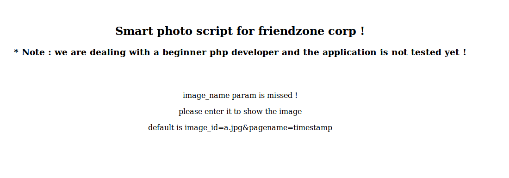
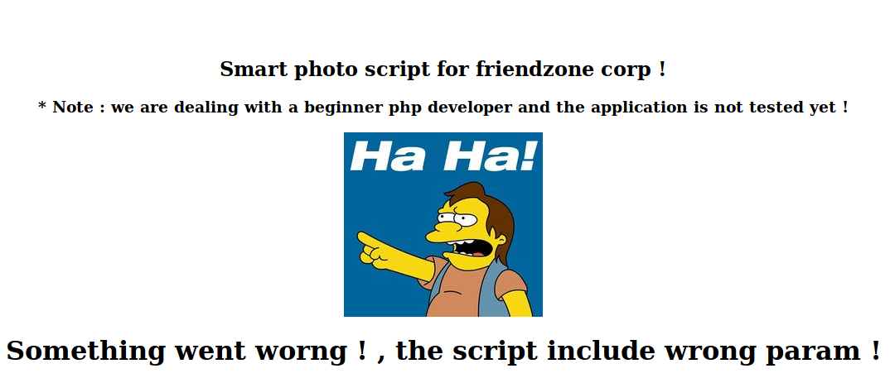

## Notes & Writeup for the Friendzonebox

# Checking open ports

Run the following command to check for open ports:

```shell
nmap -A -sC -sV 10.10.10.123
```

This resulted in the following nmap output

```shell
Starting Nmap 7.80 ( https://nmap.org ) at 2020-10-21 01:20 CEST
Nmap scan report for friendzoneportal.red (10.10.10.123)
Host is up (0.023s latency).
Not shown: 993 closed ports
PORT    STATE SERVICE     VERSION
21/tcp  open  ftp         vsftpd 3.0.3
22/tcp  open  ssh         OpenSSH 7.6p1 Ubuntu 4 (Ubuntu Linux; protocol 2.0)
| ssh-hostkey:
|   2048 a9:68:24:bc:97:1f:1e:54:a5:80:45:e7:4c:d9:aa:a0 (RSA)
|   256 e5:44:01:46:ee:7a:bb:7c:e9:1a:cb:14:99:9e:2b:8e (ECDSA)
|_  256 00:4e:1a:4f:33:e8:a0:de:86:a6:e4:2a:5f:84:61:2b (ED25519)
53/tcp  open  domain      ISC BIND 9.11.3-1ubuntu1.2 (Ubuntu Linux)
| dns-nsid:
|_  bind.version: 9.11.3-1ubuntu1.2-Ubuntu
80/tcp  open  http        Apache httpd 2.4.29 ((Ubuntu))
|_http-server-header: Apache/2.4.29 (Ubuntu)
|_http-title: Friend Zone Escape software
139/tcp open  netbios-ssn Samba smbd 3.X - 4.X (workgroup: WORKGROUP)
443/tcp open  ssl/http    Apache httpd 2.4.29
|_http-server-header: Apache/2.4.29 (Ubuntu)
|_http-title: Watching you !
| ssl-cert: Subject: commonName=friendzone.red/organizationName=CODERED/stateOrProvinceName=CODERED/countryName=JO
| Not valid before: 2018-10-05T21:02:30
|_Not valid after:  2018-11-04T21:02:30
|_ssl-date: TLS randomness does not represent time
| tls-alpn:
|_  http/1.1
445/tcp open  netbios-ssn Samba smbd 4.7.6-Ubuntu (workgroup: WORKGROUP)
Service Info: Hosts: FRIENDZONE, 127.0.1.1; OSs: Unix, Linux; CPE: cpe:/o:linux:linux_kernel

Host script results:
|_clock-skew: mean: -59m59s, deviation: 1h43m55s, median: 0s
|_nbstat: NetBIOS name: FRIENDZONE, NetBIOS user: <unknown>, NetBIOS MAC: <unknown> (unknown)
| smb-os-discovery:
|   OS: Windows 6.1 (Samba 4.7.6-Ubuntu)
|   Computer name: friendzone
|   NetBIOS computer name: FRIENDZONE\x00
|   Domain name: \x00
|   FQDN: friendzone
|_  System time: 2020-10-21T02:21:02+03:00
| smb-security-mode:
|   account_used: guest
|   authentication_level: user
|   challenge_response: supported
|_  message_signing: disabled (dangerous, but default)
| smb2-security-mode:
|   2.02:
|_    Message signing enabled but not required
| smb2-time:
|   date: 2020-10-20T23:21:02
|_  start_date: N/A
```
From this output sevral things can be deducted:

1. Port 21 is open for ftp running [vsftpd 3.0.3](https://en.wikipedia.org/wiki/Vsftpd)
2. Port 22 is open for ssh running [OpenSHH 7.6](https://www.openssh.com/)
3. Port 53 is open for DNS running [BIND 9.11.3](https://nl.wikipedia.org/wiki/BIND)
	* BIND is DNS server software so this machine is acting as a DNS server
	* This might mean that we could query the zone file of this DNS sever possibly containing addition domains if the DNS server is misconfigured
4. Port 80 is open for HTTP running [Apache httpd 2.4.19](https://nl.wikipedia.org/wiki/Apache_(webserver))
	* Apache HTTP is a commonly used webserver, this indicated that a website is running via http on 10.10.10.123 (Hostmachine IP)
5. Port 132 is open for SMB over NetBios running [Samba 3.x-4.x](https://en.wikipedia.org/wiki/Samba_(software))
	* Note that port 445 is also open for SMB over NetBios.  6. Port 443 is open for https Running a different version of the Apache webserver 
	* Http and https connections might lead to different websites

# Finding vulnerabilities
First off I wanted to check if ftp allows anonymous login, so I ran the following command:

```shell
ftp 10.10.10.123
```

This however led to unsatifying results as anonymous login was disabled. Next I wanted to know more about the smb application running on port 132. Using the smbmap command:

```shell
smbmap -H 10.10.10.123
````

I was able to get the following output:

```shell
       Disk                                                    Permissions     Comment
       ----                                                    -----------                 -------
       print$                                                  NO ACCESS       Printer Drivers
       Files                                                   NO ACCESS       FriendZone Samba Server Files /etc/files
       General                                                 READ ONLY       FriendZone Samba Server Files
       Development                                             READ, WRITE     FriendZone Samba Server Files
       IPC$                                                    NO ACCESS       IPC Service (FriendZone server (Samba, Ubuntu))
```

Based on the output from SMBmap the following things could be deducted:
1. the Development share allows for both READ and WRITE access, in addtion we can see that the general share allows us to read files.
2. We can see the location of the Files share on the host at /etc/files. 

Using the following command I tried to acess all the shares listed by smbmap

```shell
smbclient //10.10.10.123/General
```

In the geneneral share I fround a file [creds.txt](./creds.txt) containing admin login credentials. I tried these credentials on both FTP and SSH but to no avail. Nexti checked out the webpage hostes on port. I started playing around with the url adding /index.html and /index.php. The html site did load giving an indication that this is a static website. The website also hosts an email adress: info@frienzoneportal.red.

Next i've added frienzoneportal.red as well as friedzone.red to my hostfile in /ect/hosts as the ip adress might host multiple websites. See [virtal hosting](https://en.wikipedia.org/wiki/Virtual_hosting) for more info on this.

Next I tried to find additional webpages by brute forcing directories with go-buster using the following commands:

```shell
gobustter dir -u http://friendzoneportal.red/ -w /usr/share/wordlists/dirbuster/directory-list-2.3-small.txt
gobuster dir -u http://friendzone.red/ -w /usr/share/wordlists/dirbuster/directory-list-2.3-small.txt
```

This led to the disovery of a /wordpress page and a /robots.txt but nothing interesting was found there. Next I tried to force a DNS zone transers as port 53 has BIND running indicating that the machine acts like a DNS-server. By foricing a zone trasfer I might discover new (sub)domains. In order to force a DNS zone transer one could use DIG.

```shell
dig axfr friendzoneportal.red @10.10.10.123
```

This resulted in the following output:

```shell
; <<>> DiG 9.16.4-Debian <<>> axfr friendzoneportal.red @10.10.10.123
;; global options: +cmd
friendzoneportal.red.   604800  IN      SOA     localhost. root.localhost. 2 604800 86400 2419200 604800
friendzoneportal.red.   604800  IN      AAAA    ::1
friendzoneportal.red.   604800  IN      NS      localhost.
friendzoneportal.red.   604800  IN      A       127.0.0.1
admin.friendzoneportal.red. 604800 IN   A       127.0.0.1
files.friendzoneportal.red. 604800 IN   A       127.0.0.1
imports.friendzoneportal.red. 604800 IN A       127.0.0.1
vpn.friendzoneportal.red. 604800 IN     A       127.0.0.1
friendzoneportal.red.   604800  IN      SOA     localhost. root.localhost. 2 604800 86400 2419200 604800
;; Query time: 23 msec
;; SERVER: 10.10.10.123#53(10.10.10.123)
;; WHEN: Wed Oct 21 20:00:09 CEST 2020
;; XFR size: 9 records (messages 1, bytes 309)
```

Using this technique I was able to find additional subdomains hosted on friendzoneprotal.red so I did the same for friendzone.red, resuling in the following output by dig:

```shell
; <<>> DiG 9.16.4-Debian <<>> axfr friendzone.red @10.10.10.123
;; global options: +cmd
friendzone.red.         604800  IN      SOA     localhost. root.localhost. 2 604800 86400 2419200 604800
friendzone.red.         604800  IN      AAAA    ::1
friendzone.red.         604800  IN      NS      localhost.
friendzone.red.         604800  IN      A       127.0.0.1
administrator1.friendzone.red. 604800 IN A      127.0.0.1
hr.friendzone.red.      604800  IN      A       127.0.0.1
uploads.friendzone.red. 604800  IN      A       127.0.0.1
friendzone.red.         604800  IN      SOA     localhost. root.localhost. 2 604800 86400 2419200 604800
;; Query time: 35 msec
;; SERVER: 10.10.10.123#53(10.10.10.123)
;; WHEN: Wed Oct 21 20:05:15 CEST 2020
;; XFR size: 8 records (messages 1, bytes 289)
```

After adding all the domains to my hostfile in /ect/hosts i found the admin login panel at administrator1.friendzone.red. After entering the [credentials](./cred.txt) I was redirected to <https://administrator1.friendzone.red/dashboard.php>. Which displayed the following:



Playing around with the parameters eventualy led me to get the following screen using <https://administrator1.friendzone.red/dashboard.php?image_id.jpg&pagename=dashboard.php>.



Being able to play around with the parameters in urls could indicate the following vulerabilities:


# LFI vulernability

[LFI](https://github.com/swisskyrepo/PayloadsAllTheThings/tree/master/File%20Inclusion#wrapper-phpfilter)


