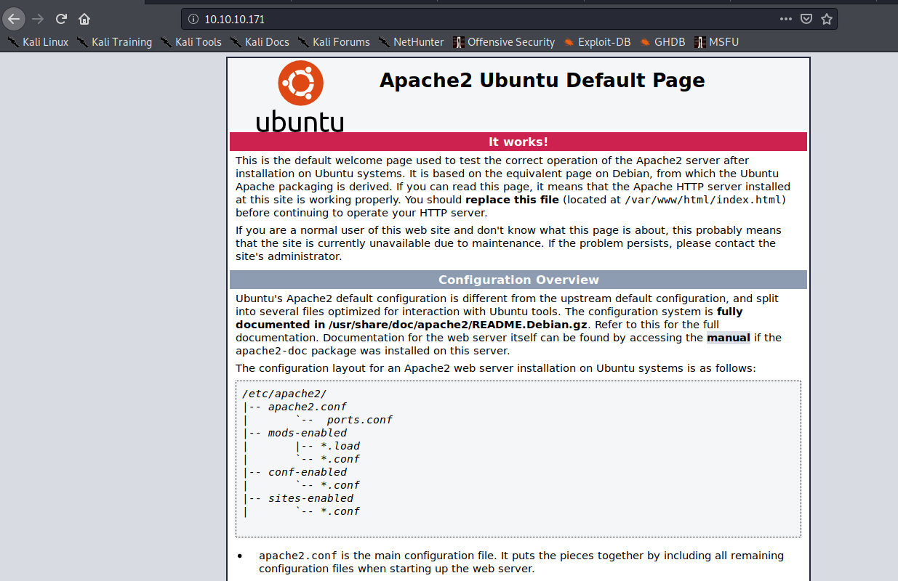
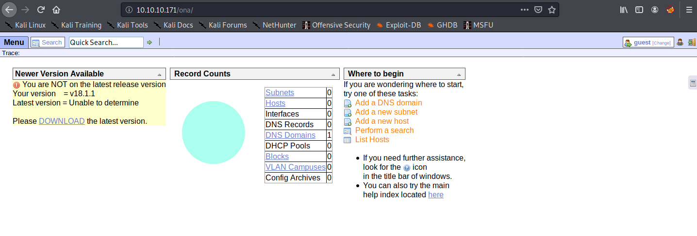

# Writeups and notes for the [openadmin](https://www.hackthebox.eu/home/machines/profile/222) box.

As usual started of with a portscan using nmap

```shell
nmap -A -sV -sC -p- -oN admin_scan.txt 10.10.10.171
```

Which resulted in the following output:

```shell
Nmap scan report for 10.10.10.171 (10.10.10.171)
Host is up (0.017s latency).
Not shown: 65533 closed ports
PORT   STATE SERVICE VERSION
22/tcp open  ssh     OpenSSH 7.6p1 Ubuntu 4ubuntu0.3 (Ubuntu Linux; protocol 2.0)
| ssh-hostkey:
|   2048 4b:98:df:85:d1:7e:f0:3d:da:48:cd:bc:92:00:b7:54 (RSA)
|   256 dc:eb:3d:c9:44:d1:18:b1:22:b4:cf:de:bd:6c:7a:54 (ECDSA)
|_  256 dc:ad:ca:3c:11:31:5b:6f:e6:a4:89:34:7c:9b:e5:50 (ED25519)
80/tcp open  http    Apache httpd 2.4.29 ((Ubuntu))
|_http-server-header: Apache/2.4.29 (Ubuntu)
|_http-title: Apache2 Ubuntu Default Page: It works
Service Info: OS: Linux; CPE: cpe:/o:linux:linux_kernel
```

So not much going on. SSH is usually pretty safe so I directed my research effort towards the webserver running. I visited the page via http on 10.10.10.171 and was greeted with the following screen:



I read the page and its just the deafult page for the Apache2 server after installation. Further enumeration is definately needed so I ran my go-to directory bruteforcer [gobuster](https://github.com/OJ/gobuster)

```shell
gobuster dir -u http://10.10.10.171 -w ~/Documents/SecLists/Discovery/Web-Content/raft-large-directories.txt
```

Using this found three pages of interest: [Artwork](./img/artwork.png), [Music](./img/music.png) and [Sierra](./img/sierra.png). This is where I got stuck. I was using [burb suite](https://portswigger.net/burp) to analyse the http requests when posting to the forms on various websites. On the Sierra page especially I found a from that was making a [POST request](https://en.wikipedia.org/wiki/POST_(HTTP)) to the server so I thought it had to do something with that. I got a nudge in the right direction. All that I needed to do was click on the login button on the [music](./img/music.png) page. I was pretty sure I did this before but somehow it didn't work. Possibly because I was running burb and didn't click to forward the request. 

Anyway click on the login button redirected me to 10.10.10.171/ona which seemed to some sort of admin panel. 



A quick google search let me to discover that ona stands for [OpenNetAdmin](https://opennetadmin.com/). The version number was also displayed. I used searchsploit to find possible exploitations for this version (18.1.1).

```shell
searchsploit OpenNetAdmin 18.1.1
```

I quickly discovered the following RCE [exploit](https://www.exploit-db.com/exploits/47691). I tried the following [script](./47691.sh) but it didn't work. I tried to fix the encoding issue using the following command:

```shell
tr -d '\r' < 47691.sh > fixed.sh
```

But unfortunately [fixed.sh](./fixed.sh) still didn't work (should probably rename this LOL). Anyway I found a python implementation of the same exploit that did [work](./ona-rce.py) and got a shell running the following command:

```shell
ona-rce.py exploit http://10.10.10.171/ona
```

I wanted to get a reversed shell so that i'd have more functionality so in order to achieve that I did the following:
* Set up a python http server on my local machine using a simple python http server
* Use wget on remote to transfer [php-reverse-shell.php](./php-reverse-shell.php) reverse shell
* Start listening on port 1235 on local for incomming traffic using netcat 
* Execute [php-reserve-shell.php](./php-reverse-shell.php) on remote.
* WE IN BOIS
   

alright next we need the user flag. Which is probably in /home/jimmy or /home/joanna but I cannot access this right now. 
